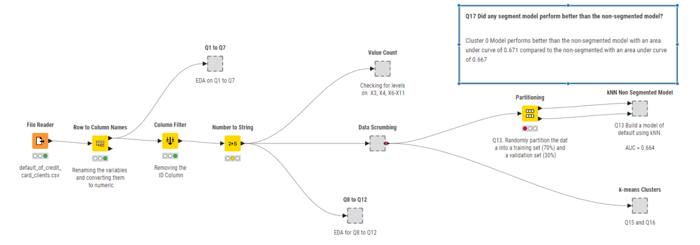

---

# **💳 Credit Default Prediction & Customer Segmentation**  
---

# 📌 Loan Default Prediction Using kNN & k-Means Clustering

## 🔍 Project Overview
This project explores **loan default prediction** for **30,000 bank customers** using **k-Nearest Neighbors (kNN) classification** and **k-Means clustering**. By segmenting customers based on age, we aim to identify patterns that influence default rates and enhance risk assessment models for financial institutions.

### 🎯 **Business Objective**
- Identify high-risk customers who are likely to default.
- Improve credit risk strategies using **customer segmentation**.
- Quantify the predictive performance of **kNN models** with and without segmentation.
- Enhance financial decision-making using clustering insights.

---

## 📂 Project Structure

```
Loan-Default-Prediction/
│── data/                      <- Dataset and processed data files.
│── images/                    <- Visualizations and workflow screenshots.
│── notebooks/                 <- Jupyter notebooks for EDA and model building.
│── knime_workflows/           <- KNIME workflow files (.knwf).
│── src/                       <- Python and R scripts used for additional analysis.
│── README.md                  <- Project documentation.
│── requirements.txt           <- Dependencies needed to run the project.
```

---

## 🔧 How to Run the Project

### 1️⃣ Clone this Repository
```sh
git clone https://github.com/EvidenceM290/Loan-Default-Prediction.git
cd Loan-Default-Prediction
```

### 2️⃣ Install Required Libraries
```sh
pip install -r requirements.txt
```

---

## 📊 **Exploratory Data Analysis (EDA)**

### 📌 Dataset Overview
- **30,000 customers** included in the dataset.
- **Key predictors**: Credit amount, repayment history, bill statements, past payments, age, education, and marital status.
- **Target variable**: **DEFAULT** (1 = Default, 0 = No Default).

### 📌 Distribution of Bill Statements
- Customers show high variability in **bill amounts** across six months.
- **Outliers detected** at the upper range of bill statements, requiring data transformation.


### 📌 Default Rates by Age
- Younger customers tend to default more frequently.
- Customers **below 30 years old** show a **higher risk profile**.


### 📌 Default Rates by Education Level
- Customers with **lower education levels (high school or below)** show a **higher default rate**.
- **Graduate school attendees** have the lowest default rate.


### 📌 Correlation Analysis
- **Strongest correlations** found between **past repayment behaviors (PAY_X) and loan default**.
- Weak correlation between **age and default**.


---

## 🏗 **Model Development**

### 📌 Workflow Overview:
This **KNIME workflow** pre-processes the dataset, applies **kNN classification**, and segments customers using **k-means clustering**.



### 📌 kNN Model Performance:
#### 🔹 Confusion Matrix
- **Model Accuracy**: **78%**
- **True Positive Rate (Recall)**: **95.7%**
- **Precision**: **80.1%**
- **Misclassification Rate**: **22%**


#### 🔹 ROC Curve for kNN Model
- **AUC Score**: **0.667**, indicating a moderate predictive ability.


---

## 🎯 **Clustering Insights (k-Means)**
### 📌 Optimal k Selection:
- **Elbow Method** suggests **k=3** for segmenting customers based on **age**.


### 📌 Cluster-Specific kNN Models:
- **Cluster 0** (Older customers) → **AUC = 0.671** (Best performing segment)
- **Cluster 1** (Middle-aged customers) → **AUC = 0.658**
- **Cluster 2** (Younger customers) → **AUC = 0.638**

### 📌 Performance Comparison:
- The **segmented models outperform the non-segmented model**, improving credit risk assessment.
- **Cluster 0 customers are more predictable**, making them **ideal for personalized credit policies**.


---

## 📌 **Business Implications & Strategic Recommendations**
### 🔹 Risk Mitigation Strategies:
- **Personalized Credit Limits**: Younger customers with high default risks should receive stricter credit limits.
- **Targeted Financial Education**: Customers with **lower education levels** benefit from financial planning programs.
- **Behavioral Risk Models**: Combining **past repayment behaviors with clustering insights** improves risk assessment.

### 🔹 Implementation in Banking Strategy:
- **Automated loan approvals** integrating **kNN models** for quick decision-making.
- **Customer segmentation** for **differentiated interest rates** based on risk groups.
- **Marketing campaigns** tailored for each cluster to **reduce default rates**.

---

## 🔥 **Key Takeaways**
✅ **kNN achieves 78% accuracy** in predicting defaults.  
✅ **Customer segmentation enhances model performance**.  
✅ **Cluster 0 customers show the best predictive accuracy (AUC = 0.671)**.  
✅ **Banks can use these insights to refine credit risk policies and customer engagement strategies**.  

---

## 🏆 **Final Thoughts**
This project demonstrates how **kNN and k-means clustering** can be applied in **credit risk analysis** to improve decision-making in **loan approvals and financial planning**. The segmentation strategy helps **financial institutions enhance their risk models** and offer **better-customized loan products**.

---

### 🚀 **Future Enhancements**
🔹 **Feature Engineering**: Explore **additional financial variables** for better accuracy.  
🔹 **Deep Learning Models**: Compare kNN with **neural networks**.  
🔹 **Real-Time Scoring**: Deploy as a **live model for instant loan approval**.  

---

## 📩 **Connect With Me**
📧 **Email**: [your-email@example.com](mailto:your-email@example.com)  
🔗 **LinkedIn**: [Your LinkedIn Profile](https://linkedin.com/in/your-profile)  
🌍 **GitHub**: [EvidenceM290](https://github.com/EvidenceM290)  

---
